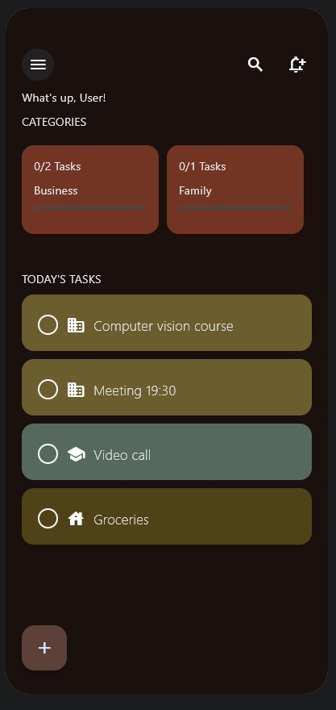
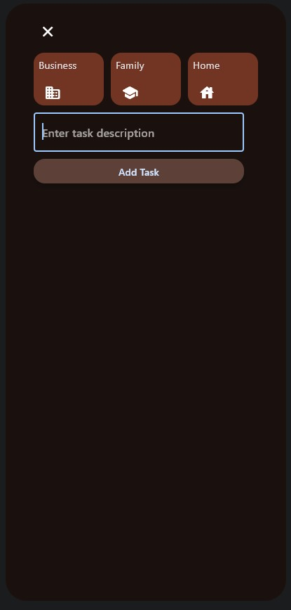

# Momentum Task Manager

Momentum is a beautifully designed task management application built with [Flet](https://flet.dev/). It allows users to create, edit, categorize, and track their tasks efficiently.

## Features

- **Task Creation**: Add tasks with specific categories.
- **Task Editing**: Modify task details and categories.
- **Category Management**: View tasks by category with dynamic progress bars.
- **Visual Feedback**: Check off completed tasks and track progress.
- **Responsive UI**: Designed to be used across various devices.

## Screenshots
<div style="display: flex; justify-content: space-between;">
    
    
</div>

## Installation

1. Clone the repository:
    ```sh
    git clone https://github.com/yourusername/momentum.git
    ```
2. Navigate to the project directory:
    ```sh
    cd momentum
    ```
3. Install the required dependencies:
    ```sh
    pip install -r requirements.txt
    ```
4. Run the application:
    ```sh
    python momentum.py
    ```

## Usage

- **Add a Task**: Click the "Add Task" button, fill in the task details, and select a category.
- **Edit a Task**: Click the edit button next to the task you want to modify.
- **Delete a Task**: Click the delete button to remove a task.
- **Track Progress**: View the progress bars under each category to see completed tasks.

## Code Structure

- `momentum.py`: Main application file containing the core logic and UI components.
- `CustomCheckBox.py`: Custom checkbox component with integrated task actions.

## Contributing

Contributions are welcome! Please fork this repository and submit a pull request for any enhancements or bug fixes.

1. Fork the repository
2. Create your feature branch (`git checkout -b feature/NewFeature`)
3. Commit your changes (`git commit -m 'Add some feature'`)
4. Push to the branch (`git push origin feature/NewFeature`)
5. Open a pull request

## License

This project is licensed under the MIT License - see the [LICENSE](LICENSE) file for details.

## Contact

Feel free to reach out for any questions or feedback:
- **LinkedIn**: [your-linkedin-profile](https://www.linkedin.com/in/maher-salah-4940271b9/)
